# Udacity Robotics Nano Degree 
## Map My World Project 
---

### Abstract :
this project aims to apply SLAM (Simultaneous localization and mapping) algorithum to a mobil robot using ROS and Gazebo for simulation along with RTAB-Map to create a 2D occupancy grid and a 3D octomap 

### Introduction:
in some environments is not always possible to provide a map to the Robot to use it for navigation as we saw in Localization problem (where the robot was provided with a map and it has to localize itself w.r.t the map) like navigating in an unknown environment (place to discover)
here where SLAM comes to solve this Problem 

**in this Project** a simulated mobile Robot will teleop in an unknown environment and map this environment
the mobile **Robot** is provided with RGB-D Camera and Laser scanner

### Background :
In SLAM a Robot gets just  the measurement coming from sensors  and motions coming from actuators and it's asked to map and localize itself ,which makes SLAM challenging comparing to Localization Problem  

**Given : ** 
The robot's controls
Observations (measurements )
**Wanted :**
Map of the environment
Path of the robot 

### 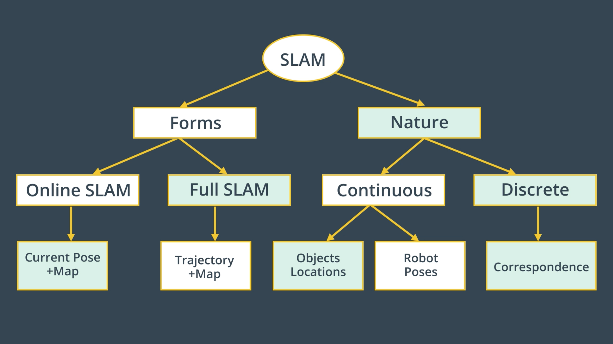

*

**Online SLAM ** : estmatining the current pose and the map using the current measurement and controls (most recent pose)

**Full SLAM** : estmatining the all poses (trajectory) and the map using the all measurements and controls 

there are many algorithms that solve Slam for Example : Fast SLAM and Graph SLAM

**Fast SLAM** : 

Grid-Based FastSLAM uses  MCL (Monte Carlo Localization) Algorithm and  Occupancy Grid Mapping.

it assumes there are always known landmark positions. which makes it not useful to model arbitrary  environment 

**Graph SLAM** :

* Use a graph to represent the problem

* Every node in the graph corresponds to a pose of the robot during mapping

* Every edge between two nodes corresponds to a spatial constraint between them
* Graph-Based SLAM: Build the graph and find a node configuration that minimize the error introduced by the constraints

**

RTAB-Map is a Graph-SLAM approach , it uses loop closure with Visual Bag-of-Words for optimization.

a _loop closure detection_ is the _process involved when trying to find a match between the current and a previously visited locations in SLAM_

### Scene and Robot Configuration :
#### Scene Configuration :

i created a new Scene using Gazebo i tried to simulate Home-Environment but with Random Objects from public Gazebo Database 
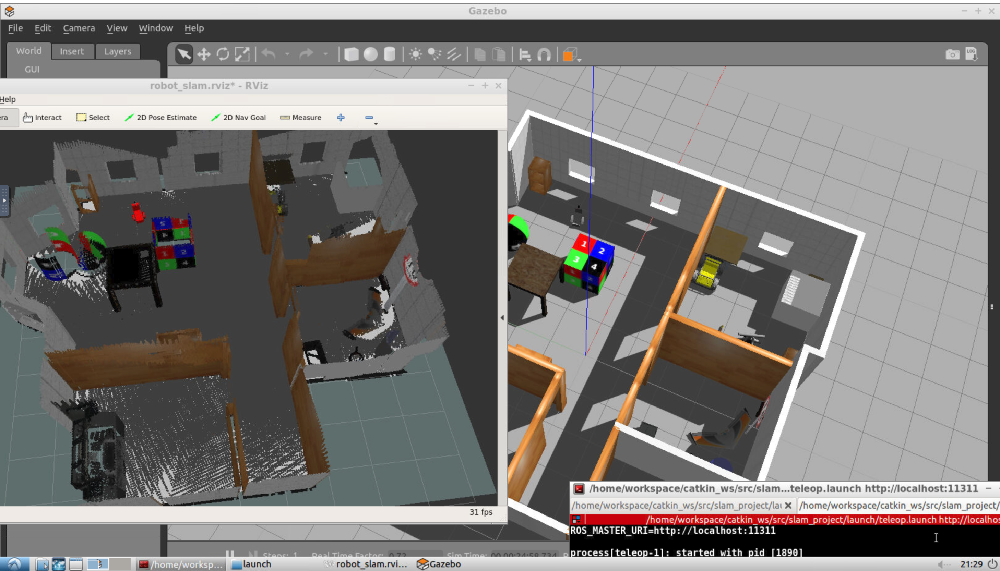

#### Robot Configuration : 

the same Robot i built in Loclaztion Project
The Robot has as i moentioned above : Laser Scanner and RGB-D Camera 
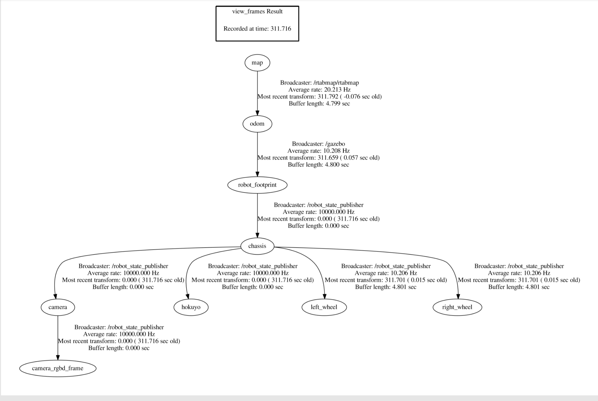

### Results : 

#### kitchen_dining :

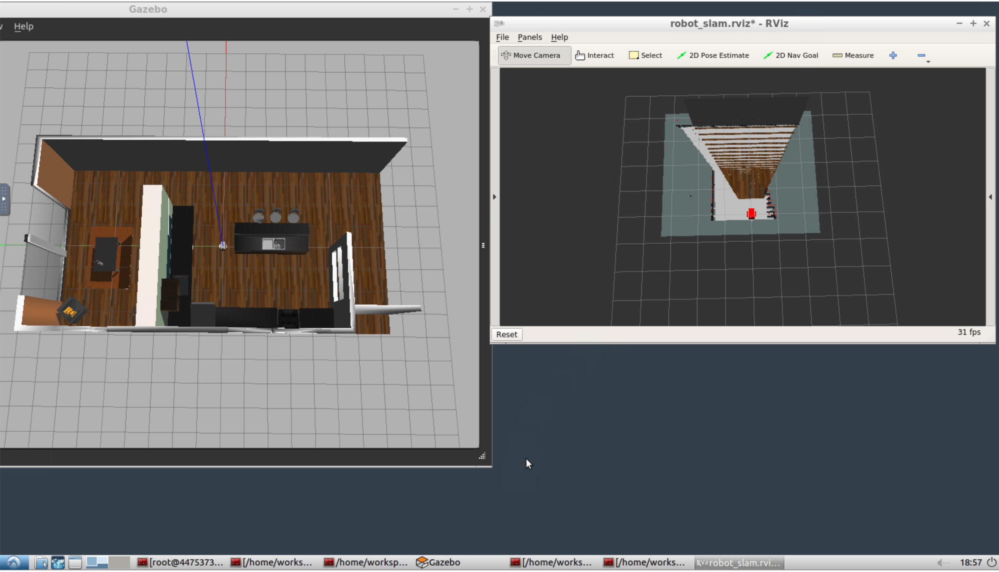
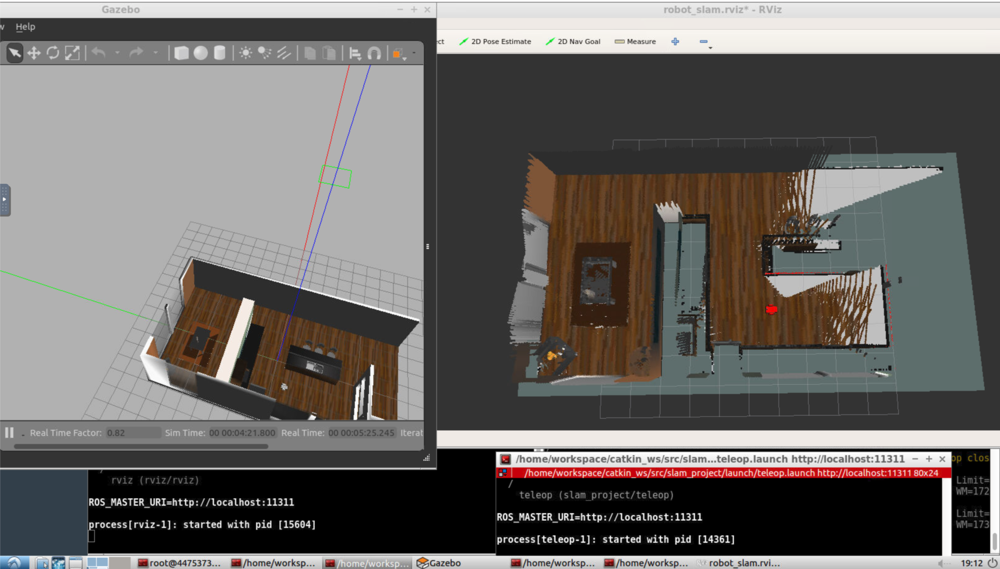
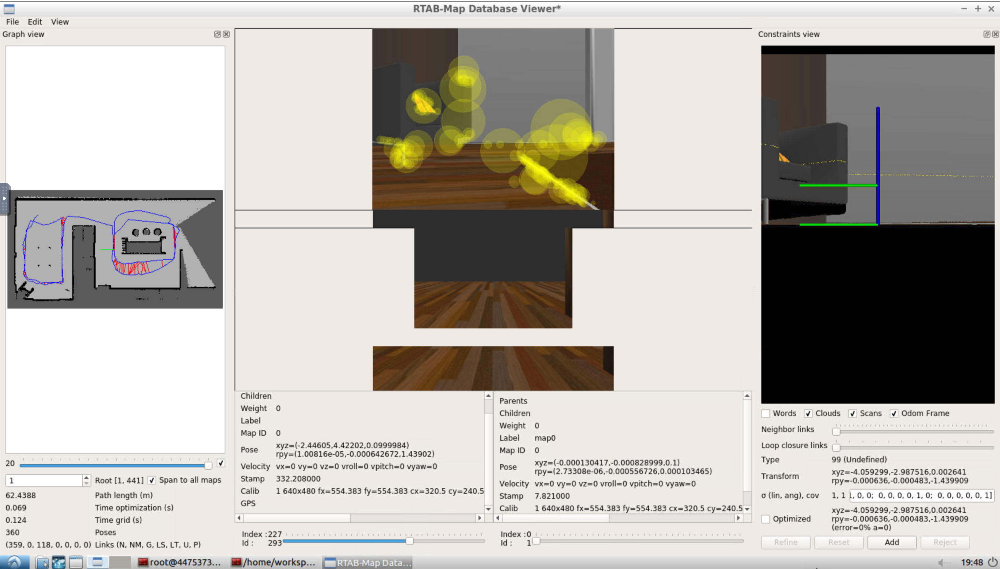

#### My World :

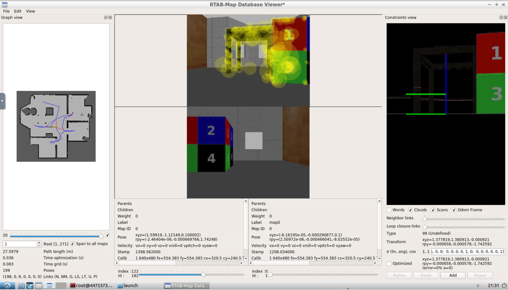

### Discusion:
Mapping The provided Kitchen environment was a straight forward process, although it failed at the first time because it didn't extract many features from the images as it just walked one time in some places 
provided Kitchen environment was contains Feature-rich Objects which made the Task easier and avoided production of False loop-closures
on the other Hand, mapping "My world" was a bit challenging in the beginng as I tried with Feature-Poor Objects and walls with the same Texture it failed many times then I added some Objects to the scene to make it rich with features so it succeeded 
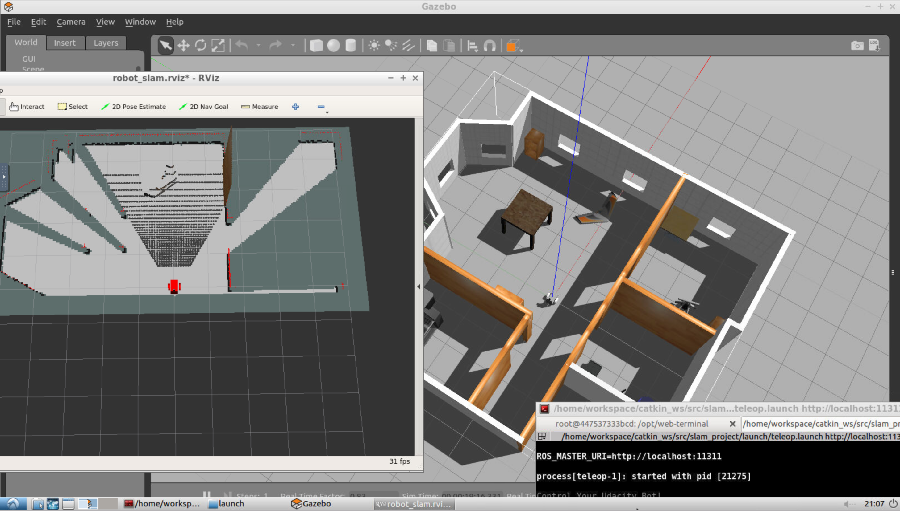
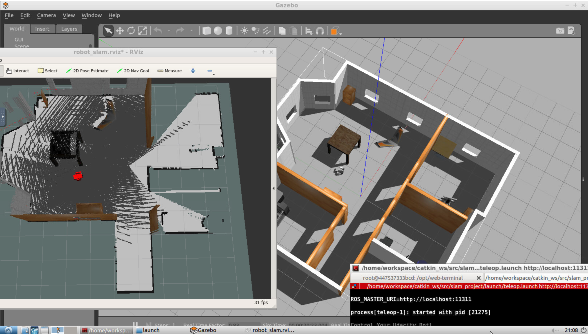
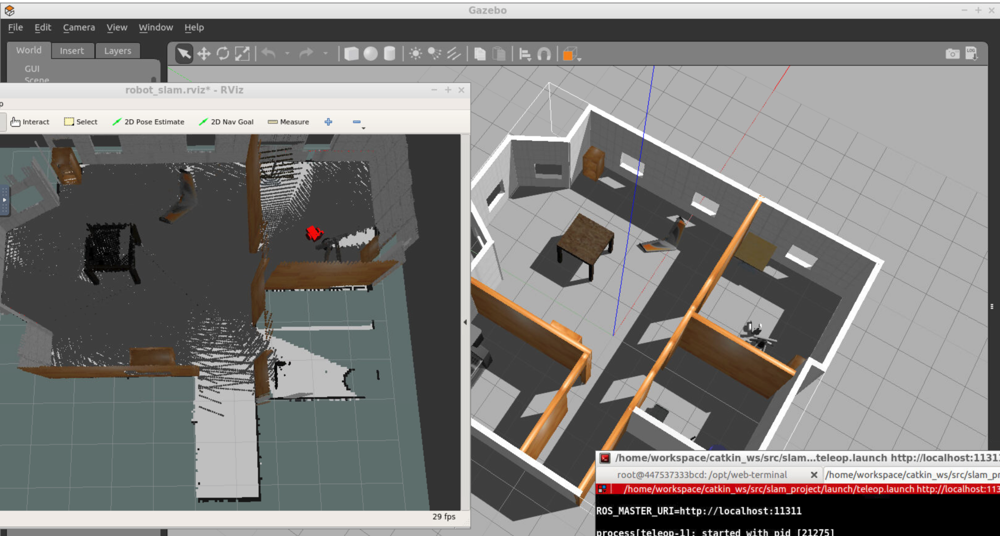
until now everything was fine then the robot went to the other room. which looks like the previous one so it produced False loop-closures 
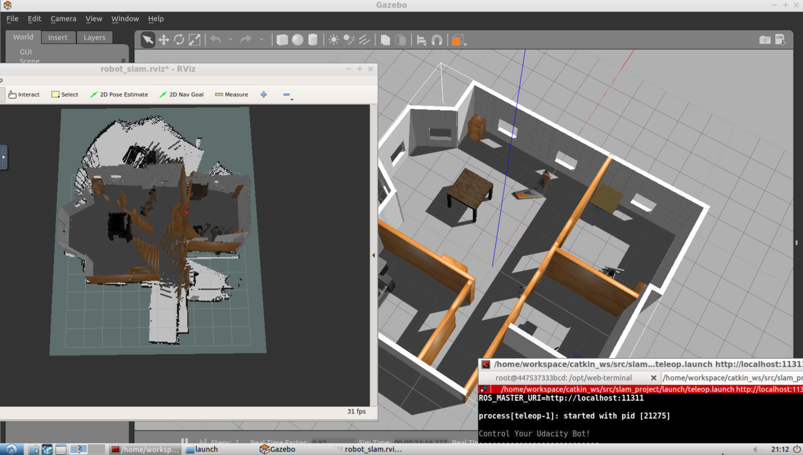
adding other Feature-Rich objects

### Future Work :

RTAB-Map mapping algorithm provided a quick result, on the other hand however it produced False loop-closures and needs parameter-tunning and assumes the objects are static, which will not provide a good result if a robot is deployed in real environment .the next Step will be trying to deploy it on Jetson Tx2 see it work in my room in a real environment 

*Udacity Classroom

** university Freiburg 